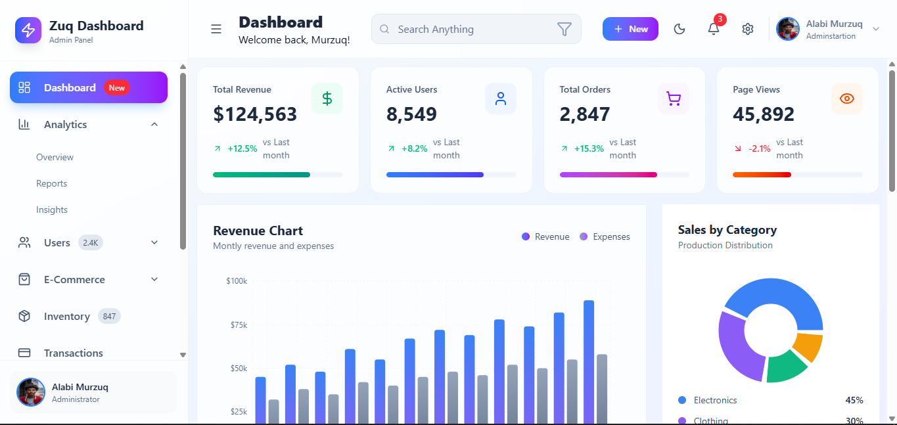
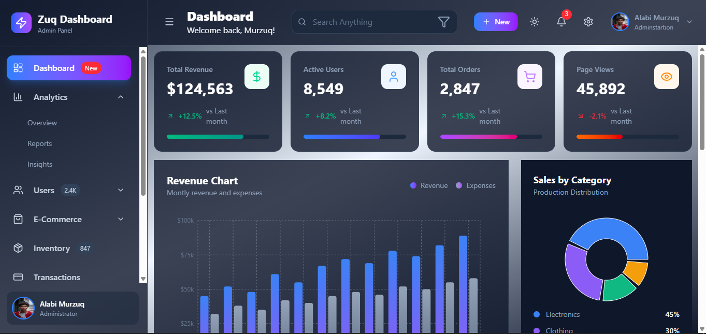

<div align="center">

# Zuq Admin Dashboard


A modern, responsive admin dashboard built with React, TypeScript, and Tailwind CSS. This project features a clean user interface with dark mode support, glassmorphism effects, and a modular component structure.

<p align="center">
  <a href="#-installation">Getting Started</a> •
  <a href="https://github.com/Murzuq/Zuq-Admin-Dashboard/issues">Report Bug</a> •
  <a href="https://github.com/Murzuq/Zuq-Admin-Dashboard/issues">Request Feature</a>
</p>

</div>

## 📸 Screenshots

<!-- Add screenshots of your dashboard here. Example: -->
<!--  -->
<!--  -->




## ✨ Features

- **Responsive Design**: Fully responsive layout that adapts to mobile, tablet, and desktop screens.
- **Dark Mode Support**: Built-in light and dark theme toggle with persistent state.
- **Modern UI**: Utilizes Tailwind CSS for styling with glassmorphism effects (`backdrop-blur`).
- **Icons**: Integrated `lucide-react` for beautiful, consistent iconography.
- **Fast Build**: Powered by Vite for lightning-fast development and HMR.

## 🛠️ Tech Stack

- **Framework**: React
- **Language**: TypeScript
- **Build Tool**: Vite
- **Styling**: Tailwind CSS (v4)
- **Icons**: Lucide React

## 📂 Project Structure

```text
src/
├── components/   # Reusable UI components (Buttons, Cards, etc.)
├── layouts/      # Layout wrappers (Sidebar, Header)
└── App.tsx       # Main application entry
```

## 📦 Installation

1. **Clone the repository**

   ```bash
   git clone https://github.com/Murzuq/Zuq-Admin-Dashboard.git
   cd Zuq-Admin-Dashboard
   ```

2. **Install dependencies**

   ```bash
   npm install
   ```

3. **Start the development server**
   ```bash
   npm run dev
   ```

## 📜 Available Scripts

In the project directory, you can run:

- `npm run dev`: Runs the app in the development mode.
- `npm run build`: Builds the app for production to the `dist` folder.
- `npm run lint`: Lints the codebase using ESLint.
- `npm run preview`: Locally preview the production build.

## 🔧 Configuration

This project uses **Tailwind CSS v4**. The configuration is handled via `@tailwindcss/vite` in `vite.config.ts` and `tailwind.config.ts`.

Ensure your `tailwind.config.ts` is set up for selector-based dark mode:

```typescript
export default {
  content: ['./index.html', './src/**/*.{js,ts,jsx,tsx}'],
  darkMode: 'selector',
  // ...
};
```

## 🤝 Contributing

Contributions are welcome! Please feel free to submit a Pull Request.

## 📄 License

This project is licensed under the MIT License.
